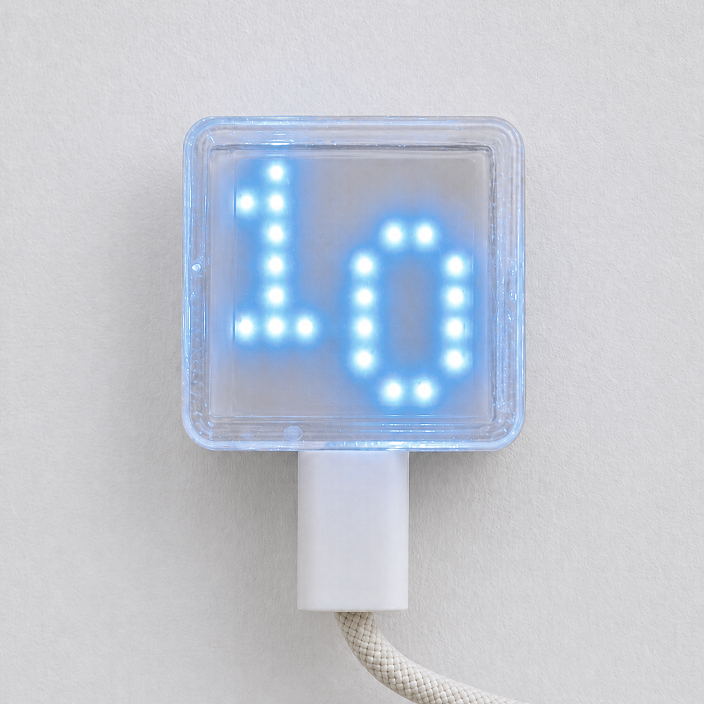
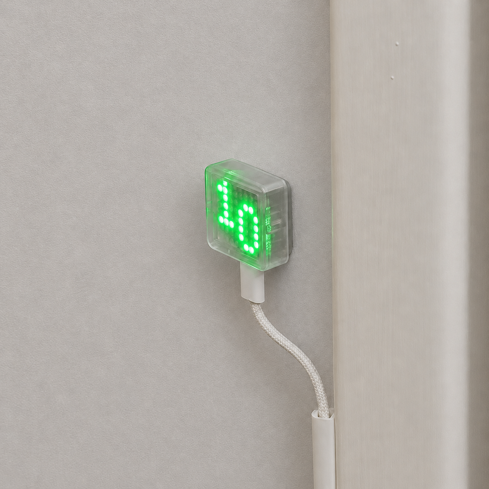

# <b><p align="center">Nästa »  Mini</p></b>

<p align="center">
  A little box that tells you when the next SL (Stockholm Local Transport) departure is leaving.<br>One glance on your way out the door and you'll know if you can stroll or if you need to sprint.
</p>

<p align="center">
  
  
  
</p>

---

<p align="center">
  
</p>

The <i>Nästa Mini</i> built around an ESP32-S3 with an 8×8 RGB LED matrix and a single push button on the back. Run through the setup portal once, and from then on it just sits there showing your next departure in a color that does the thinking for you.

| Color | Meaning |
|---|---|
|  | means you're already too late.
|  | means hurry up.
|  or  |  means relax, take your time.

It only shows one direction at a time, but switching is easy: a short button press toggles between direction 1 and direction 2. Use one to glance at your own commute out, and the other to keep an eye on when someone else is due to arrive.

A long press drops you into setup mode.

## Setup

On first boot (or after a long button press), the device opens its own Wi-Fi access point called `nasta-mini-setup`. Connect to it and a captive portal should pop up on its own. If your phone or laptop is being stubborn about it, just open `http://setup.nasta-mini/` in a browser yourself. From there you can set:

- Your Wi-Fi credentials
- The SL site ID for your stop
- A transport mode filter (any, metro, train, bus, tram)
- Walk time in minutes (sets up when the color gradient is triggered)
- Brightness, startup direction, and display orientation

Don't know your stop's SL site ID off the top of your head? Nobody does. Look it up in Trafiklab's SL stop data tools and grab the numeric `site_id`.

## Display states

The matrix talks to you in color and the occasional symbol. Here's the full vocabulary:

| &nbsp; | State | Meaning |
|:---:|---|---|
|  | Boot animation | Starting up |
|  | Color wheel | Connecting to Wi-Fi |
|  | Green "OK" | Connected, waiting for first data |
|  | Pulsating white animation | Setup mode |
|  | Color ramp | Departure in N minutes. Color reflects urgency |
|  | Yellow `?` | No departures available |
|  | Red `?` | API error |
|  | Red `x` | Network error |

## Hardware



Built and tested on the [Waveshare ESP32-S3-Matrix](https://www.waveshare.com/esp32-s3-matrix.htm) development board, which already packages the ESP32-S3 and the 8×8 RGB LED matrix together. The only thing added on afterward is a push button on the back.

- **MCU**: ESP32-S3
- **Display**: 8×8 RGB LED matrix
- **Input**: one push button

The electronics lives inside a two-part 3D printed case. Print files are in [hardware/3d-print/](hardware/3d-print/):

- [`front_v.1.0.3mf`](hardware/3d-print/front_v.1.0.3mf)
- [`back_v.1.0.3mf`](hardware/3d-print/back_v.1.0.3mf)

## API

Departures come from the [SL Transport API](https://www.trafiklab.se/sv/api/our-apis/sl/transport/), polled every 10 seconds. Only departures with state `EXPECTED` make the cut.

This product is based on information retrieved from [Trafiklab.se](https://www.trafiklab.se/).

## Building

Tested with ESP-IDF `v5.5.3` for target `esp32s3`.

Open an ESP-IDF shell and build/flash like you would any other ESP-IDF project:

```sh
idf.py set-target esp32s3
idf.py build
idf.py -p <PORT> flash monitor
```

Thanks for reading, now go catch your ride!

## License
This repository is source-available, not open source. See [LICENSE](LICENSE) for the governing terms.

Third-party software notices live in [THIRD-PARTY-NOTICES.md](THIRD-PARTY-NOTICES.md).
